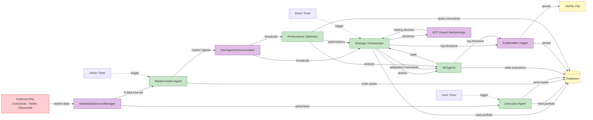
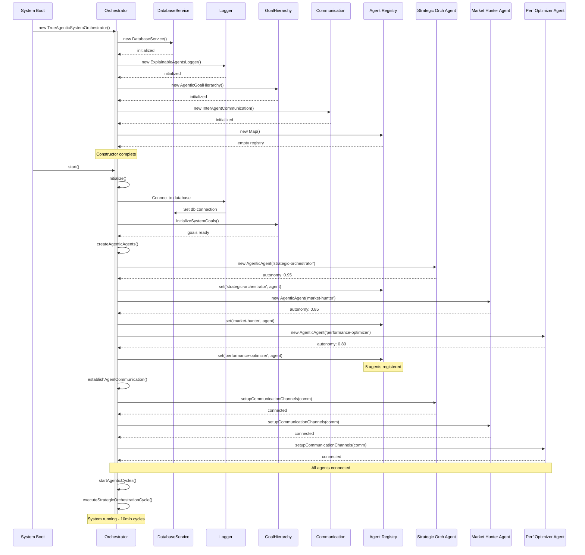
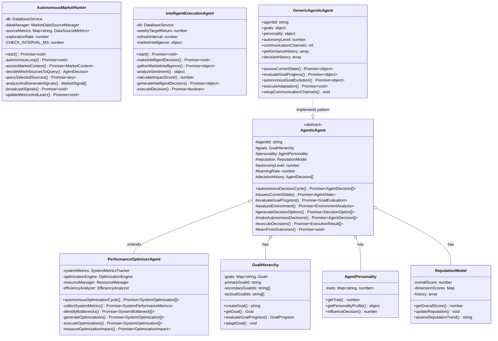

# 🔬 Agentic Components - Deep Architecture Diagram

Complete system architecture showing all agentic components, their connections, data flows, and interactions at the finest level of detail.

---

## 📊 Full System Architecture (Mermaid Diagram)

```mermaid
graph TB
    %% ========================================
    %% SYSTEM ENTRY POINT
    %% ========================================
    START[System Boot<br/>true-agentic-orchestrator.js:1169]
    START --> ORCH_INIT

    %% ========================================
    %% ORCHESTRATOR LAYER
    %% ========================================
    subgraph ORCHESTRATOR["🧠 TRUE AGENTIC SYSTEM ORCHESTRATOR"]
        ORCH_INIT[Constructor<br/>Lines 17-43]
        ORCH_INIT --> DB_INIT[DatabaseService<br/>database-service.js]
        ORCH_INIT --> LOGGER_INIT[ExplainableAgentsLogger<br/>explainable-agents-logger.js]
        ORCH_INIT --> EXPERT_INIT[BTCExpertMethodology<br/>btc-expert-methodology.js]
        ORCH_INIT --> GOALS_INIT[AgenticGoalHierarchy<br/>Lines 971-999]
        ORCH_INIT --> COMM_INIT[InterAgentCommunication<br/>Lines 1001-1020]
        ORCH_INIT --> PERF_INIT[SystemPerformanceTracker<br/>Lines 1022-1041]
        ORCH_INIT --> EMERGE_INIT[EmergentBehaviorDetector<br/>Lines 1043-1052]
        ORCH_INIT --> CONFLICT_INIT[ConflictResolutionEngine<br/>Lines 1054-1064]
        
        ORCH_INIT --> AGENT_MAPS[Agent Tracking Maps<br/>autonomyLevels<br/>agentReputations]
    end

    %% ========================================
    %% INITIALIZATION PHASE
    %% ========================================
    subgraph INIT_PHASE["🚀 INITIALIZATION PHASE"]
        INIT_START[initialize Method<br/>Lines 44-64]
        INIT_START --> SET_LOGGER_DB[Connect Logger to DB]
        INIT_START --> INIT_GOALS[initializeSystemGoals]
        INIT_START --> CREATE_AGENTS[createAgenticAgents<br/>Lines 572-622]
        INIT_START --> ESTABLISH_COMM[establishAgentCommunication<br/>Lines 626-636]
        INIT_START --> INIT_LEARNING[initializeSystemLearning]
    end

    ORCH_INIT --> INIT_START

    %% ========================================
    %% AGENT CREATION PROCESS
    %% ========================================
    subgraph AGENT_CREATION["🤖 AGENT CREATION & REGISTRATION"]
        CREATE_AGENTS --> A1[Strategic Orchestrator<br/>AgenticAgent<br/>autonomy: 0.95<br/>analytical: 95<br/>strategic: 90]
        CREATE_AGENTS --> A2[Market Hunter<br/>AgenticAgent<br/>autonomy: 0.85<br/>aggressive: 85<br/>curious: 95]
        CREATE_AGENTS --> A3[Performance Optimizer<br/>AgenticAgent<br/>autonomy: 0.80<br/>systematic: 90<br/>persistent: 80]
        CREATE_AGENTS --> A4[Content Creator<br/>AgenticAgent<br/>autonomy: 0.75<br/>creative: 90<br/>engaging: 85]
        CREATE_AGENTS --> A5[Market Analyzer<br/>AgenticAgent<br/>autonomy: 0.80<br/>methodical: 85<br/>accurate: 90]
        
        A1 --> AGENT_MAP[agents Map<br/>Registry]
        A2 --> AGENT_MAP
        A3 --> AGENT_MAP
        A4 --> AGENT_MAP
        A5 --> AGENT_MAP
        
        AGENT_MAP --> AUTO_MAP[autonomyLevels Map<br/>Per-agent tracking]
        AGENT_MAP --> REP_MAP[agentReputations Map<br/>Starting: 0.7]
    end

    %% ========================================
    %% AGENTIC AGENT CLASS STRUCTURE
    %% ========================================
    subgraph AGENT_CLASS["📦 AgenticAgent Class (Lines 1066-1167)"]
        AC_PROPS[Properties]
        AC_PROPS --> AC_ID[agentId: string]
        AC_PROPS --> AC_GOALS[goals: object]
        AC_PROPS --> AC_PERS[personality: object]
        AC_PROPS --> AC_AUTO[autonomyLevel: number]
        AC_PROPS --> AC_COMM[communicationChannels: ref]
        AC_PROPS --> AC_HIST[performanceHistory: array]
        AC_PROPS --> AC_DEC[decisionHistory: array]
        AC_PROPS --> AC_ADAPT[adaptationCount: number]
        
        AC_METHODS[Methods]
        AC_METHODS --> AC_ASSESS[assessCurrentState<br/>Returns performance metrics]
        AC_METHODS --> AC_EVAL[evaluateGoalProgress<br/>Returns progress & needs]
        AC_METHODS --> AC_EVOLVE[autonomousGoalEvolution<br/>Self-adapts goals]
        AC_METHODS --> AC_LOG[logAutonomousDecision<br/>Logs to database]
        AC_METHODS --> AC_UPDATE[updateAutonomyLevel<br/>Adjusts freedom]
        AC_METHODS --> AC_EXEC[executeAdaptation<br/>Implements changes]
        AC_METHODS --> AC_SETUP[setupCommunicationChannels<br/>Connects to comm]
    end

    %% ========================================
    %% STRATEGIC CYCLE
    %% ========================================
    subgraph STRATEGIC_CYCLE["🔄 STRATEGIC ORCHESTRATION CYCLE (Every 10 min)"]
        SC_START[executeStrategicOrchestrationCycle<br/>Lines 108-168]
        
        SC_START --> SC_P1[PHASE 1: Assess System State<br/>assessSystemWideState<br/>Lines 174-210]
        SC_P1 --> SC_P1_PORT[Get Portfolio<br/>db.getLivePortfolio]
        SC_P1 --> SC_P1_AGENTS[Loop all agents<br/>agent.assessCurrentState]
        SC_P1 --> SC_P1_CALC[Calculate Metrics<br/>systemEfficiency<br/>strategicAlignment<br/>adaptationCapacity]
        
        SC_P1 --> SC_P2[PHASE 2: Evaluate Performance<br/>evaluateAllAgentPerformance<br/>Lines 212-246]
        SC_P2 --> SC_P2_LOOP[For each agent]
        SC_P2_LOOP --> SC_P2_REP[Get reputation from Map]
        SC_P2_LOOP --> SC_P2_AUTO[Get autonomy from Map]
        SC_P2_LOOP --> SC_P2_GOAL[Call agent.evaluateGoalProgress]
        SC_P2_LOOP --> SC_P2_SCORE[Calculate performanceScore<br/>reputation + progress + autonomy / 3]
        SC_P2_LOOP --> SC_P2_ACTION[Generate recommendedActions<br/>GOAL_ADAPTATION<br/>INCREASE_AUTONOMY]
        
        SC_P2 --> SC_P3[PHASE 3: Detect Conflicts<br/>detectInterAgentConflicts<br/>Lines 248-264]
        SC_P3 --> SC_P3_PAIRS[Loop agent pairs]
        SC_P3 --> SC_P3_ANALYZE[analyzeAgentConflict<br/>Check goal conflicts]
        SC_P3 --> SC_P3_EMERGE[detectEmergentBehaviors<br/>Find coordination patterns]
        
        SC_P3 --> SC_P4[PHASE 4: Make Decisions<br/>makeStrategicDecisions<br/>Lines 266-390]
        SC_P4 --> SC_P4_PRICE[Get Current BTC Price<br/>getCurrentBitcoinPrice]
        SC_P4 --> SC_P4_PORT[Get Portfolio State]
        SC_P4 --> SC_P4_EXPERT[Call Expert Methodology<br/>expertMethodology.makeExpertDecision]
        SC_P4 --> SC_P4_DEC[Generate Decisions<br/>TRADING_DECISION<br/>AGENT_ADAPTATION<br/>SYSTEM_OPTIMIZATION]
        
        SC_P4 --> SC_P5[PHASE 5: Goal Adaptation<br/>autonomousGoalEvolution<br/>Lines 392-420]
        SC_P5 --> SC_P5_LOOP[For each adaptation decision]
        SC_P5 --> SC_P5_AGENT[Get agent from Map]
        SC_P5 --> SC_P5_EVOLVE[Call agent.autonomousGoalEvolution]
        SC_P5 --> SC_P5_LOG[Log adaptation to database]
        
        SC_P5 --> SC_P6[PHASE 6: Coordinate Actions<br/>coordinateAgentActions<br/>Lines 422-480]
        SC_P6 --> SC_P6_EXEC[executeAgentAdaptation]
        SC_P6 --> SC_P6_MSG[Send Inter-Agent Messages<br/>agentCommunicationChannel]
        SC_P6 --> SC_P6_RUN[agent.executeAdaptation]
        
        SC_P6 --> SC_P7[PHASE 7: System Learning<br/>systemWideLearning<br/>Lines 482-530]
        SC_P7 --> SC_P7_QUAL[Calculate Decision Quality]
        SC_P7 --> SC_P7_EFF[Calculate Adaptation Effectiveness]
        SC_P7 --> SC_P7_UPDATE[Update System Metrics<br/>systemPerformance.updateMetrics]
        
        SC_P7 --> SC_P8[PHASE 8: Autonomy Adjustment<br/>adaptiveAutonomyAdjustment<br/>Lines 532-570]
        SC_P8 --> SC_P8_EVAL[Evaluate Performance]
        SC_P8 --> SC_P8_INC[If score > 0.85<br/>Increase autonomy +5%]
        SC_P8 --> SC_P8_DEC[If score < 0.5<br/>Decrease autonomy -10%]
        SC_P8 --> SC_P8_UPDATE[Update autonomyLevels Map]
        
        SC_P8 --> SC_P9[PHASE 9: Log to Database<br/>logStrategicCycle]
        SC_P9 --> SC_P9_DB[Write to agent_executions<br/>Write to agent_decisions]
    end

    INIT_LEARNING --> SC_START

    %% ========================================
    %% DATABASE LAYER
    %% ========================================
    subgraph DATABASE["🗄️ DATABASE LAYER (SQLite)"]
        DB_SERVICE[DatabaseService<br/>database-service.js]
        
        DB_SERVICE --> DB_TABLE1[(agent_executions<br/>id, timestamp, agent_name<br/>execution_type, input_data<br/>output_data, success<br/>execution_time_ms, error_message)]
        
        DB_SERVICE --> DB_TABLE2[(agent_decisions<br/>id, timestamp, agent, type<br/>context JSON, reasoning JSON<br/>outcome JSON, agent_state JSON<br/>system JSON, feedback JSON)]
        
        DB_SERVICE --> DB_TABLE3[(portfolio<br/>id, btc_balance<br/>usd_balance, last_updated)]
        
        DB_SERVICE --> DB_TABLE4[(portfolio_history<br/>timestamp, btc_balance<br/>usd_balance, btc_price_usd<br/>total_value_usd)]
        
        DB_SERVICE --> DB_TABLE5[(trades<br/>timestamp, trade_type<br/>amount_btc, price_usd<br/>total_usd, agent_decision_reason<br/>executed_by)]
        
        DB_SERVICE --> DB_TABLE6[(market_data<br/>timestamp, price_usd<br/>volume_24h, price_change_24h<br/>fear_greed_index)]
        
        DB_METHODS[Key Methods]
        DB_METHODS --> DB_M1[logAgentExecution<br/>Lines 207-220]
        DB_METHODS --> DB_M2[getAgentExecutions<br/>Lines 221-235]
        DB_METHODS --> DB_M3[getLivePortfolio<br/>Returns current state]
        DB_METHODS --> DB_M4[recordTrade<br/>Logs trade execution]
    end

    %% ========================================
    %% EXPLAINABLE AGENTS LOGGER
    %% ========================================
    subgraph LOGGER["📝 EXPLAINABLE AGENTS LOGGER"]
        LOG_INIT[ExplainableAgentsLogger]
        LOG_INIT --> LOG_CONFIG[Configuration<br/>useDatabase: true<br/>logFile: agent-decisions.jsonl]
        
        LOG_METHODS[Methods]
        LOG_METHODS --> LOG_DEC[logDecision<br/>Comprehensive logging]
        LOG_DEC --> LOG_CONTEXT[Context<br/>trigger, inputs, systemState<br/>marketConditions]
        LOG_DEC --> LOG_REASONING[Reasoning<br/>analysis, alternatives<br/>selectedOption, confidence<br/>riskAssessment]
        LOG_DEC --> LOG_OUTCOME[Outcome<br/>action, parameters<br/>expectedResult, success]
        LOG_DEC --> LOG_AGENT_STATE[Agent State<br/>autonomyLevel, learningRate<br/>performanceScore, goals]
        LOG_DEC --> LOG_SYSTEM[System Context<br/>cycleId, interAgentComm<br/>emergentBehaviors]
        LOG_DEC --> LOG_FEEDBACK[Feedback<br/>learningAdjustments<br/>strategyShifts]
        
        LOG_DEC --> LOG_DB_WRITE[Write to agent_decisions]
        LOG_DEC --> LOG_FILE_WRITE[Append to JSONL file]
    end

    %% ========================================
    %% INTER-AGENT COMMUNICATION
    %% ========================================
    subgraph COMMUNICATION["💬 INTER-AGENT COMMUNICATION"]
        COMM_CLASS[InterAgentCommunication<br/>Lines 1001-1020]
        
        COMM_CLASS --> COMM_QUEUE[messageQueue: array<br/>Pending messages]
        COMM_CLASS --> COMM_CHAN[channels: Map<br/>Per-agent channels]
        
        COMM_METHODS[Methods]
        COMM_METHODS --> COMM_SEND[sendMessage<br/>fromAgent, toAgent, message]
        COMM_METHODS --> COMM_GET[getMessages<br/>Filter by recipient]
        
        COMM_SEND --> COMM_MSG_STRUCT[Message Structure<br/>fromAgent, toAgent<br/>message, timestamp]
        
        COMM_MSG_STRUCT --> COMM_DELIVERY[Push to messageQueue<br/>Deliver to recipient]
    end

    %% ========================================
    %% AUTONOMOUS MARKET HUNTER
    %% ========================================
    subgraph MARKET_HUNTER["🎯 AUTONOMOUS MARKET HUNTER"]
        MH_CLASS[AutonomousMarketHunter<br/>autonomous-market-hunter.ts]
        
        MH_INIT[Constructor]
        MH_INIT --> MH_DB[DatabaseService]
        MH_INIT --> MH_DATA[MarketDataSourceManager]
        MH_INIT --> MH_METRICS[sourceMetrics Map<br/>Track 8 sources]
        MH_INIT --> MH_CONFIG[Configuration<br/>CHECK_INTERVAL: 10min<br/>explorationRate: 0.2<br/>learningRate: 0.1]
        
        MH_START[start Method<br/>Lines 110-125]
        MH_START --> MH_LOAD[loadHistoricalMetrics<br/>Learn from past]
        MH_START --> MH_LOOP[autonomousLoop<br/>Lines 139-212]
        
        MH_LOOP --> MH_WHILE[while isRunning]
        MH_WHILE --> MH_C1[1. assessMarketContext<br/>volatility, trend, volume<br/>timeOfDay, fearGreedIndex]
        MH_C1 --> MH_C2[2. decideWhichSourcesToQuery<br/>Lines 220-280<br/>Score each source:<br/>- successRate 30%<br/>- signalQuality 30%<br/>- recency 20%<br/>- contextRelevance 40%<br/>- exploration bonus]
        MH_C2 --> MH_C3[3. querySelectedSources<br/>Query top 5 of 8 sources]
        MH_C3 --> MH_C4[4. analyzeAndGenerateSignals<br/>severity: low/medium/high/critical<br/>targetAgents: list]
        MH_C4 --> MH_C5[5. broadcastSignals<br/>Send via agentCommunicationChannel]
        MH_C5 --> MH_C6[6. updateMetricsAndLearn<br/>Update sourceMetrics Map<br/>successRate, avgSignalQuality]
        MH_C6 --> MH_C7[7. persistCycleData<br/>Store in database]
        MH_C7 --> MH_SLEEP[8. sleep 10 minutes]
        MH_SLEEP --> MH_WHILE
        
        MH_SOURCES[8 Data Sources]
        MH_SOURCES --> MH_S1[whaleMovements]
        MH_SOURCES --> MH_S2[narrativeShifts]
        MH_SOURCES --> MH_S3[arbitrageOpportunities]
        MH_SOURCES --> MH_S4[influencerSignals]
        MH_SOURCES --> MH_S5[technicalBreakouts]
        MH_SOURCES --> MH_S6[institutionalFlows]
        MH_SOURCES --> MH_S7[derivativesSignals]
        MH_SOURCES --> MH_S8[macroSignals]
    end

    %% ========================================
    %% PERFORMANCE OPTIMIZER
    %% ========================================
    subgraph PERF_OPT["⚡ PERFORMANCE OPTIMIZER AGENT"]
        PO_CLASS[PerformanceOptimizerAgent<br/>performance-optimizer-agent.ts]
        
        PO_EXTENDS[Extends AgenticAgent<br/>agentic-agent.ts]
        
        PO_INIT[Constructor]
        PO_INIT --> PO_METRICS[SystemMetricsTracker]
        PO_INIT --> PO_ENGINE[OptimizationEngine]
        PO_INIT --> PO_RESOURCE[ResourceManager]
        PO_INIT --> PO_EFFICIENCY[EfficiencyAnalyzer]
        
        PO_CYCLE[autonomousOptimizationCycle<br/>Lines 61-89]
        PO_CYCLE --> PO_1[1. collectSystemMetrics<br/>Lines 92-118]
        PO_1 --> PO_1A[analyzeAgentPerformance<br/>decisionCount, successRate<br/>responseTime, coordination]
        PO_1 --> PO_1B[analyzeResourceUtilization<br/>CPU, memory, network]
        PO_1 --> PO_1C[analyzeDecisionQuality<br/>confidence, outcomes]
        PO_1 --> PO_1D[analyzeCoordinationEfficiency<br/>message latency, success rate]
        
        PO_1 --> PO_2[2. identifyBottlenecks<br/>Lines 139-200]
        PO_2 --> PO_2A[Response Time Bottlenecks<br/>threshold: >2000ms]
        PO_2 --> PO_2B[Success Rate Bottlenecks<br/>threshold: <70%]
        PO_2 --> PO_2C[Coordination Bottlenecks<br/>threshold: <0.6]
        
        PO_2 --> PO_3[3. generateOptimizations<br/>Lines 202-280]
        PO_3 --> PO_3A[Reactive Optimizations<br/>Fix immediate issues]
        PO_3 --> PO_3B[Proactive Optimizations<br/>Prevent future problems]
        
        PO_3 --> PO_4[4. executeOptimizations<br/>Lines 282-350]
        PO_4 --> PO_4A[Priority Sorting]
        PO_4 --> PO_4B[Risk Assessment]
        PO_4 --> PO_4C[Implementation]
        PO_4 --> PO_4D[Rollback on failure]
        
        PO_4 --> PO_5[5. measureOptimizationImpact<br/>Lines 352-400]
        PO_5 --> PO_5A[Compare Before/After Metrics]
        PO_5 --> PO_5B[Calculate % Improvement]
        PO_5 --> PO_5C[Update Learning Model]
    end

    %% ========================================
    %% INTELLIGENT EXECUTION AGENT
    %% ========================================
    subgraph EXEC_AGENT["💼 INTELLIGENT EXECUTION AGENT"]
        EXE_CLASS[IntelligentExecutionAgent<br/>intelligent-execution-agent.js]
        
        EXE_INIT[Constructor]
        EXE_INIT --> EXE_CONFIG[Configuration<br/>weeklyTargetReturn: 5%<br/>refreshInterval: 1min<br/>startingValue: $10,000]
        EXE_INIT --> EXE_DB[DatabaseService]
        EXE_INIT --> EXE_CACHE[Market Intelligence Cache<br/>cacheDuration: 5min]
        
        EXE_START[start Method<br/>Lines 25-60]
        EXE_START --> EXE_IMMEDIATE[Immediate Decision<br/>makeIntelligentDecision]
        EXE_START --> EXE_INTERVAL[setInterval<br/>Every 1 minute]
        
        EXE_DECISION[makeIntelligentDecision<br/>Lines 67-135]
        EXE_DECISION --> EXE_D1[1. gatherMarketIntelligence<br/>Lines 152-200]
        EXE_D1 --> EXE_D1A[Fetch Bitcoin Price<br/>API: /api/bitcoin-price]
        EXE_D1 --> EXE_D1B[Fetch Bitcoin News<br/>API: /api/bitcoin-news]
        EXE_D1 --> EXE_D1C[Fetch Market Analysis<br/>API: /api/market-analysis]
        EXE_D1 --> EXE_D1D[Analyze Sentiment<br/>positive/negative keywords]
        EXE_D1 --> EXE_D1E[Calculate Impact Score<br/>recency + credibility]
        
        EXE_DECISION --> EXE_D2[2. Get Portfolio<br/>db.getCurrentPortfolio]
        EXE_DECISION --> EXE_D3[3. Calculate Weekly Progress<br/>progressPercent, daysRemaining]
        EXE_DECISION --> EXE_D4[4. generateIntelligentDecision<br/>Lines 291-365]
        EXE_D4 --> EXE_D4A[Combine Goal Progress<br/>+ Market Intelligence]
        EXE_D4 --> EXE_D4B[Decision Logic<br/>Behind target → BUY<br/>Ahead + bearish → SELL<br/>Otherwise → HOLD]
        
        EXE_DECISION --> EXE_D5[5. Execute Decision<br/>executeDecision]
        EXE_DECISION --> EXE_D6[6. Log to Database<br/>db.logAgentExecution]
    end

    %% ========================================
    %% CORE AGENCY FRAMEWORK
    %% ========================================
    subgraph CORE_AGENCY["🏛️ CORE AGENCY FRAMEWORK"]
        CA_BASE[AgenticAgent Base Class<br/>agentic-agent.ts:15-694]
        
        CA_PROPS[Core Properties]
        CA_PROPS --> CA_ID[agentId: string]
        CA_PROPS --> CA_GOALS[goals: GoalHierarchy]
        CA_PROPS --> CA_PERS[personality: AgentPersonality]
        CA_PROPS --> CA_REP[reputation: ReputationModel]
        CA_PROPS --> CA_REGIME[marketRegime: MarketRegime]
        CA_PROPS --> CA_AUTO[autonomyLevel: 0-1]
        CA_PROPS --> CA_LEARN[learningRate: 0.1]
        CA_PROPS --> CA_HIST[decisionHistory: array]
        CA_PROPS --> CA_STRAT[strategies: Map]
        
        CA_CYCLE[autonomousDecisionCycle<br/>Lines 42-74]
        CA_CYCLE --> CA_C1[1. assessCurrentState<br/>Lines 77-99]
        CA_CYCLE --> CA_C2[2. evaluateGoalProgress<br/>Lines 101-110]
        CA_CYCLE --> CA_C3[3. analyzeEnvironment<br/>Market regime, competitors]
        CA_CYCLE --> CA_C4[4. generateDecisionOptions<br/>Multiple strategies]
        CA_CYCLE --> CA_C5[5. makeAutonomousDecisions<br/>Select best option]
        CA_CYCLE --> CA_C6[6. executeDecisions<br/>Implement chosen action]
        CA_CYCLE --> CA_C7[7. learnFromOutcomes<br/>Update models]
        CA_CYCLE --> CA_C8[8. recordDecisions<br/>Store in history]
        
        CA_SUPPORT[Supporting Classes]
        CA_SUPPORT --> CA_GOAL_H[GoalHierarchy<br/>core-agency.ts:17-200]
        CA_SUPPORT --> CA_REP_M[ReputationModel<br/>core-agency.ts:202-300]
        CA_SUPPORT --> CA_PERS_M[AgentPersonality<br/>core-agency.ts:302-400]
        CA_SUPPORT --> CA_REGIME_M[MarketRegime<br/>core-agency.ts:402-500]
    end

    %% ========================================
    %% BTC EXPERT METHODOLOGY
    %% ========================================
    subgraph EXPERT["🎓 BTC EXPERT METHODOLOGY"]
        EXP_CLASS[BTCExpertMethodology<br/>btc-expert-methodology.js]
        
        EXP_DECISION[makeExpertDecision<br/>Main entry point]
        EXP_DECISION --> EXP_D1[Analyze Market Data<br/>price, volume, volatility]
        EXP_DECISION --> EXP_D2[Analyze Portfolio State<br/>totalValue, holdings, cash]
        EXP_DECISION --> EXP_D3[Analyze System State<br/>agentPerformance, efficiency]
        EXP_DECISION --> EXP_D4[Apply Trading Rules<br/>Risk management<br/>Position sizing<br/>Timing optimization]
        EXP_DECISION --> EXP_D5[Generate Decision<br/>action: BUY/SELL/HOLD<br/>amount, confidence<br/>reasoning]
        
        EXP_RULES[Expert Rules]
        EXP_RULES --> EXP_R1[Risk Management<br/>Max position size<br/>Stop loss levels]
        EXP_RULES --> EXP_R2[Market Timing<br/>Entry/exit signals<br/>Trend following]
        EXP_RULES --> EXP_R3[Portfolio Balance<br/>Diversification<br/>Rebalancing triggers]
    end

    %% ========================================
    %% MARKET DATA SOURCES
    %% ========================================
    subgraph MARKET_DATA["📡 MARKET DATA SOURCES"]
        MDS_CLASS[MarketDataSourceManager<br/>market-data-sources.ts]
        
        MDS_METHODS[Methods]
        MDS_METHODS --> MDS_ALL[fetchAllDataSources<br/>Fetch all 8 sources in parallel]
        MDS_METHODS --> MDS_WHALE[fetchWhaleMovements<br/>Large transaction monitoring]
        MDS_METHODS --> MDS_NARR[fetchNarrativeShifts<br/>Social sentiment analysis]
        MDS_METHODS --> MDS_ARB[fetchArbitrageOpportunities<br/>Price differences]
        MDS_METHODS --> MDS_INFL[fetchInfluencerSignals<br/>Key opinion leaders]
        MDS_METHODS --> MDS_TECH[fetchTechnicalBreakouts<br/>Chart patterns]
        MDS_METHODS --> MDS_INST[fetchInstitutionalFlows<br/>Large player tracking]
        MDS_METHODS --> MDS_DERIV[fetchDerivativesSignals<br/>Futures/options data]
        MDS_METHODS --> MDS_MACRO[fetchMacroSignals<br/>Economic indicators]
        
        MDS_APIS[External APIs]
        MDS_APIS --> MDS_API1[CoinGecko API<br/>Price & market data]
        MDS_APIS --> MDS_API2[Twitter/X API<br/>Social sentiment]
        MDS_APIS --> MDS_API3[Glassnode API<br/>On-chain data]
        MDS_APIS --> MDS_API4[CCXT Exchanges<br/>Trading data]
        MDS_APIS --> MDS_API5[News APIs<br/>Market news]
    end

    %% ========================================
    %% DATA FLOW CONNECTIONS
    %% ========================================
    
    %% Orchestrator to Agents
    SC_P2_LOOP -.->|queries| A1
    SC_P2_LOOP -.->|queries| A2
    SC_P2_LOOP -.->|queries| A3
    SC_P2_LOOP -.->|queries| A4
    SC_P2_LOOP -.->|queries| A5
    
    %% Agents to Database
    AC_LOG -->|writes| DB_TABLE1
    AC_LOG -->|writes| DB_TABLE2
    MH_C7 -->|writes| DB_TABLE1
    EXE_D6 -->|writes| DB_TABLE1
    
    %% Database reads
    SC_P1_PORT -->|reads| DB_TABLE3
    SC_P4_PORT -->|reads| DB_TABLE3
    EXE_D2 -->|reads| DB_TABLE3
    PO_1A -->|reads| DB_TABLE1
    
    %% Inter-agent communication
    MH_C5 -->|broadcasts| COMM_SEND
    COMM_DELIVERY -.->|delivers to| A1
    COMM_DELIVERY -.->|delivers to| A3
    COMM_DELIVERY -.->|delivers to| A4
    
    %% Market data flow
    MH_C3 -->|fetches| MDS_ALL
    EXE_D1A -->|fetches| MDS_APIS
    
    %% Expert methodology usage
    SC_P4_EXPERT -->|uses| EXP_DECISION
    
    %% Logger connections
    SC_P9_DB -->|uses| LOG_DEC
    AC_LOG -->|uses| LOG_DEC
    LOG_DB_WRITE -->|writes| DB_TABLE2
    
    %% Performance optimizer queries
    PO_1A -.->|analyzes| AGENT_MAP
    PO_1D -.->|measures| COMM_CLASS
    
    %% Core agency inheritance
    PO_EXTENDS ---|inherits| CA_BASE
    
    %% Autonomous cycles timing
    SC_START -.->|every 10min| SC_START
    MH_SLEEP -.->|every 10min| MH_WHILE
    EXE_INTERVAL -.->|every 1min| EXE_DECISION

    %% ========================================
    %% LEGEND
    %% ========================================
    subgraph LEGEND["📖 LEGEND"]
        L1[Solid Arrow = Direct Call/Reference]
        L2[Dotted Arrow = Data Flow/Query]
        L3[Thick Arrow = Inheritance]
        L4[Box Colors:<br/>Blue = Core System<br/>Green = Agents<br/>Yellow = Data/Storage<br/>Purple = Services]
    end

    %% Styling
    classDef orchestratorClass fill:#e1f5ff,stroke:#01579b,stroke-width:3px
    classDef agentClass fill:#e8f5e9,stroke:#2e7d32,stroke-width:2px
    classDef databaseClass fill:#fff9c4,stroke:#f57f17,stroke-width:2px
    classDef serviceClass fill:#f3e5f5,stroke:#6a1b9a,stroke-width:2px
    classDef cycleClass fill:#ffe0b2,stroke:#e65100,stroke-width:2px
    
    class ORCH_INIT,ORCHESTRATOR,INIT_PHASE orchestratorClass
    class AGENT_CREATION,AGENT_CLASS,A1,A2,A3,A4,A5,MARKET_HUNTER,PERF_OPT,EXEC_AGENT,CORE_AGENCY agentClass
    class DATABASE,DB_SERVICE,DB_TABLE1,DB_TABLE2,DB_TABLE3,DB_TABLE4,DB_TABLE5,DB_TABLE6 databaseClass
    class LOGGER,COMMUNICATION,EXPERT,MARKET_DATA serviceClass
    class STRATEGIC_CYCLE,SC_P1,SC_P2,SC_P3,SC_P4,SC_P5,SC_P6,SC_P7,SC_P8,SC_P9 cycleClass
```

---

## 🔍 Component Relationship Matrix

| Component | Depends On | Provides To | Communication Method |
|-----------|------------|-------------|---------------------|
| **TrueAgenticSystemOrchestrator** | DatabaseService, ExplainableAgentsLogger, BTCExpertMethodology | Strategic decisions, agent coordination | Direct method calls |
| **AgenticAgent (Generic)** | InterAgentCommunication | State assessment, goal progress | Method invocation by orchestrator |
| **AutonomousMarketHunter** | DatabaseService, MarketDataSourceManager | Market signals | Broadcast via communication channel |
| **PerformanceOptimizerAgent** | DatabaseService, agent_executions table | System optimizations | Database queries + direct analysis |
| **IntelligentExecutionAgent** | DatabaseService, Market APIs | Trade execution | setInterval + database logging |
| **DatabaseService** | SQLite database | Data persistence | SQL queries |
| **ExplainableAgentsLogger** | DatabaseService, JSONL file | Decision logging | Database writes + file appends |
| **InterAgentCommunication** | messageQueue, channels Map | Message delivery | Push/pull message queue |
| **BTCExpertMethodology** | Market data, portfolio state | Trading decisions | Pure function calls |
| **MarketDataSourceManager** | External APIs (8 sources) | Market intelligence | HTTP API calls |

---

## 📊 Data Flow Diagram



---

## 🔄 Initialization Sequence Diagram



---

## 🎯 Strategic Cycle Detailed Flow

```mermaid
stateDiagram-v2
    [*] --> CycleStart: Timer triggers (10 min)
    
    CycleStart --> Phase1: Begin cycle
    
    state Phase1 {
        [*] --> GetPortfolio: Assess System
        GetPortfolio --> QueryAgents
        QueryAgents --> CalcMetrics
        CalcMetrics --> [*]: System state ready
    }
    
    Phase1 --> Phase2
    
    state Phase2 {
        [*] --> LoopAgents: Evaluate Performance
        LoopAgents --> GetReputation
        GetReputation --> GetAutonomy
        GetAutonomy --> GetGoalProgress
        GetGoalProgress --> CalcScore
        CalcScore --> GenActions
        GenActions --> [*]: Evaluations complete
    }
    
    Phase2 --> Phase3
    
    state Phase3 {
        [*] --> CheckConflicts: Detect Issues
        CheckConflicts --> FindEmergent
        FindEmergent --> [*]: Conflicts identified
    }
    
    Phase3 --> Phase4
    
    state Phase4 {
        [*] --> GetPrice: Make Decisions
        GetPrice --> GetPortfolio2
        GetPortfolio2 --> CallExpert
        CallExpert --> GenDecisions
        GenDecisions --> [*]: Decisions ready
    }
    
    Phase4 --> Phase5
    
    state Phase5 {
        [*] --> FilterAdaptations: Goal Adaptation
        FilterAdaptations --> CallAgentEvolve
        CallAgentEvolve --> LogAdaptations
        LogAdaptations --> [*]: Goals evolved
    }
    
    Phase5 --> Phase6
    
    state Phase6 {
        [*] --> ExecAdaptations: Coordinate Actions
        ExecAdaptations --> SendMessages
        SendMessages --> RunAgentActions
        RunAgentActions --> [*]: Actions executed
    }
    
    Phase6 --> Phase7
    
    state Phase7 {
        [*] --> CalcQuality: System Learning
        CalcQuality --> CalcEffectiveness
        CalcEffectiveness --> UpdateMetrics
        UpdateMetrics --> [*]: Learning complete
    }
    
    Phase7 --> Phase8
    
    state Phase8 {
        [*] --> EvalPerf: Autonomy Adjustment
        EvalPerf --> AdjustLevels
        AdjustLevels --> UpdateMaps
        UpdateMaps --> [*]: Autonomy adjusted
    }
    
    Phase8 --> Phase9
    
    state Phase9 {
        [*] --> WriteDB: Log Everything
        WriteDB --> [*]: Logged
    }
    
    Phase9 --> WaitTimer: Cycle complete
    WaitTimer --> CycleStart: 10 minutes elapsed
```



---

## 🧩 Agent Class Hierarchy



---

## 📈 Key Metrics & Thresholds

| Metric | Threshold | Action Triggered |
|--------|-----------|------------------|
| **Agent Performance Score** | > 0.85 | Increase autonomy +5% |
| **Agent Performance Score** | < 0.5 | Decrease autonomy -10% |
| **Response Time** | > 2000ms | Bottleneck detected |
| **Success Rate** | < 70% | Optimization needed |
| **Coordination Score** | < 0.6 | Communication issue |
| **Goal Progress** | < 0.6 | Adaptation required |
| **System Efficiency** | < 0.7 | System-wide optimization |
| **Market Hunter Source Score** | Top 5 | Selected for query |
| **Signal Severity** | high/critical | Broadcast to agents |
| **Trade Confidence** | > 0.7 | Execute trade |

---

This comprehensive diagram shows every agentic component, their connections, data flows, and operational details down to line numbers and specific methods! 🎯
