# 🤖 Agent Connection Graph - Complete Network

## Interactive Network Visualization

**Open this file to see the interactive graph**: [`docs/agent-network-graph.html`](./agent-network-graph.html)

The interactive version includes:
- 🖱️ **Drag nodes** to rearrange
- 🔍 **Hover** for detailed agent information
- 🎯 **Path highlighting** (Strategic, Trading, Content)
- 🎨 **Color-coded** by agent type
- 📊 **50+ connections** visualized

---

## Complete Agent Connection Map

```mermaid
graph TB
    subgraph META["🎯 META-AGENTS (95% Autonomy)"]
        SO[Strategic Orchestrator]
        TAO[True Agentic Orchestrator]
    end
    
    subgraph INTEL["🔍 INTELLIGENCE AGENTS (85-95% Autonomy)"]
        MH[Autonomous Market Hunter]
        PO[Performance Optimizer]
    end
    
    subgraph ADAPT["📊 ADAPTIVE AGENTS (75-95% Autonomy)"]
        MA[Market Analyzer]
        CC[Content Creator]
    end
    
    subgraph EXEC["💼 EXECUTION AGENTS (75% Autonomy)"]
        IEA[Intelligent Execution Agent]
    end
    
    subgraph TASK["📋 TASK AGENTS (65-70% Autonomy)"]
        DC[Data Collector]
        SP[Social Publisher]
        RP[Reddit Publisher]
    end
    
    subgraph COORD["🎼 COORDINATORS (60% Autonomy)"]
        BO[Bitcoin Orchestrator]
    end
    
    subgraph DATA["📡 DATA SOURCES"]
        DS1[🐋 Whale Movements<br/>Blockchain.info]
        DS2[📊 Narrative Shifts<br/>CoinGecko Trending]
        DS3[💱 Arbitrage Opps<br/>CCXT]
        DS4[📢 Influencer Signals<br/>CoinGecko]
        DS5[📈 Technical Breakouts<br/>OHLC]
        DS6[🏦 Institutional Flows<br/>Public Treasuries]
        DS7[📉 Derivatives<br/>Coinglass]
        DS8[🌍 Macro Signals<br/>Fear & Greed]
    end
    
    subgraph DB["💾 DATABASE"]
        DATABASE[(SQLite Database<br/>50+ Tables)]
    end
    
    %% Meta-Agent Coordination
    TAO -->|manages| SO
    TAO -->|monitors| MH
    SO -->|coordinates| MH
    SO -->|optimizes with| PO
    SO -->|manages| MA
    SO -->|manages| CC
    SO -->|manages| IEA
    SO -->|self-reflection| SO
    
    %% Market Hunter Intelligence Network
    MH -->|queries| DS1
    MH -->|queries| DS2
    MH -->|queries| DS3
    MH -->|queries| DS4
    MH -->|queries| DS5
    MH -->|queries| DS6
    MH -->|queries| DS7
    MH -->|queries| DS8
    
    %% Market Hunter Signal Distribution
    MH -->|🚨 WHALE_ALERT| IEA
    MH -->|📊 NARRATIVE_EMERGENCE| MA
    MH -->|💎 ALPHA_OPPORTUNITY| CC
    MH -->|📈 TECHNICAL_BREAKOUT| MA
    MH -->|🌊 SENTIMENT_SHIFT| IEA
    MH -->|🏦 INSTITUTIONAL_MOVE| IEA
    
    %% Data Collection Flow
    DC -->|price data| MA
    DC -->|news data| MA
    MA -->|sentiment analysis| CC
    MA -->|technical signals| IEA
    MA -->|market intelligence| CC
    
    %% Content Creation Flow
    CC -->|optimized tweets| SP
    CC -->|reddit posts| RP
    
    %% Orchestration Flow
    BO -->|schedules| DC
    BO -->|triggers| MA
    BO -->|coordinates| CC
    
    %% Performance Optimization
    PO -->|analyzes| SO
    PO -->|optimizes| MH
    PO -->|improves| MA
    PO -->|resource allocation| IEA
    
    %% Trading Decision Flow
    MA -->|sentiment + impact| IEA
    MH -->|market signals| IEA
    IEA -->|executes trades| IEA
    
    %% Database Logging (dotted lines)
    SO -.->|decision logs| DATABASE
    MH -.->|market data| DATABASE
    MA -.->|analysis results| DATABASE
    IEA -.->|trading history| DATABASE
    PO -.->|performance metrics| DATABASE
    SP -.->|engagement data| DATABASE
    RP -.->|post analytics| DATABASE
    TAO -.->|system state| DATABASE
    
    %% Styling
    classDef metaStyle fill:#ff6b6b,stroke:#c92a2a,stroke-width:3px,color:#fff
    classDef intelStyle fill:#4ecdc4,stroke:#0a817a,stroke-width:3px,color:#fff
    classDef adaptStyle fill:#a8e6cf,stroke:#56ab91,stroke-width:2px,color:#333
    classDef execStyle fill:#ffd93d,stroke:#d4a100,stroke-width:3px,color:#333
    classDef taskStyle fill:#95b8d1,stroke:#5a8fb3,stroke-width:2px,color:#fff
    classDef coordStyle fill:#b8bedd,stroke:#7d7fa6,stroke-width:2px,color:#333
    classDef dataStyle fill:#f38181,stroke:#e84545,stroke-width:2px,color:#fff
    classDef dbStyle fill:#95e1d3,stroke:#33ccb3,stroke-width:2px,color:#333
    
    class SO,TAO metaStyle
    class MH,PO intelStyle
    class MA,CC adaptStyle
    class IEA execStyle
    class DC,SP,RP taskStyle
    class BO coordStyle
    class DS1,DS2,DS3,DS4,DS5,DS6,DS7,DS8 dataStyle
    class DATABASE dbStyle
```



---

## 📊 Connection Types Legend

| Symbol | Type | Description |
|--------|------|-------------|
| **→** | Direct Flow | Primary data/command flow |
| **🚨** | Signal | Market signals from Market Hunter |
| **-.->** | Logging | Database persistence |
| **\|manages\|** | Coordination | Strategic oversight |
| **\|queries\|** | Data Fetch | API queries |

---

## 🔗 Key Connection Patterns

### 1️⃣ Strategic Coordination Chain
```
True Agentic Orchestrator 
    → Strategic Orchestrator 
        → All Autonomous Agents
            → Performance Feedback
                → Goal Adaptation
```

### 2️⃣ Market Intelligence Pipeline
```
8 Data Sources 
    → Market Hunter (decides which to query)
        → Analysis & Pattern Detection
            → Signals Generated
                → Distributed to: Execution, Analyzer, Creator
```

### 3️⃣ Trading Decision Flow
```
Market Hunter Signals
    +
Market Analyzer Sentiment
    +
Portfolio Progress
    +
Technical Analysis
    ↓
Intelligent Execution Agent
    ↓
BUY/SELL/HOLD Decision
    ↓
Database Logging
```

### 4️⃣ Content Creation Flow
```
Data Collector (price + news)
    ↓
Market Analyzer (sentiment + technical)
    ↓
Content Creator (tweet generation)
    ↓
Social Publisher → Twitter/X
Reddit Publisher → r/Bitcoin, r/BitcoinMarkets
```

### 5️⃣ Performance Optimization Loop
```
All Agents → Performance Metrics
    ↓
Performance Optimizer → Analyzes
    ↓
Identifies Bottlenecks
    ↓
Redistributes Resources
    ↓
Strategic Orchestrator → Implements Changes
    ↓
Agents Adapt & Improve
```

---

## 🎯 Agent Interaction Matrix

| From ↓ To → | SO | MH | PO | MA | CC | IEA | DC | SP | RP | BO | DB |
|-------------|----|----|----|----|----|----|----|----|----|----|-----|
| **Strategic Orch** | ✓ | ✓ | ✓ | ✓ | ✓ | ✓ | - | - | - | - | ✓ |
| **Market Hunter** | - | - | - | ✓ | ✓ | ✓ | - | - | - | - | ✓ |
| **Performance Opt** | ✓ | ✓ | - | ✓ | - | ✓ | - | - | - | - | ✓ |
| **Market Analyzer** | - | - | - | - | ✓ | ✓ | - | - | - | - | ✓ |
| **Content Creator** | - | - | - | - | - | - | - | ✓ | ✓ | - | - |
| **Intel Execution** | - | - | - | - | - | - | - | - | - | - | ✓ |
| **Data Collector** | - | - | - | ✓ | - | - | - | - | - | - | - |
| **Bitcoin Orch** | - | - | - | ✓ | ✓ | - | ✓ | - | - | - | - |
| **True Agentic** | ✓ | ✓ | - | - | - | - | - | - | - | - | ✓ |

✓ = Direct connection exists

---

## 🚀 Signal Types by Agent

### Market Hunter → Other Agents
```
WHALE_ALERT          → Intelligent Execution, Market Analyzer
NARRATIVE_EMERGENCE  → Content Creator, Market Analyzer
ARBITRAGE_WINDOW     → Intelligent Execution
TECHNICAL_BREAKOUT   → Market Analyzer, Intelligent Execution
SENTIMENT_SHIFT      → All Agents
INSTITUTIONAL_MOVE   → Intelligent Execution, Content Creator
```

### Market Analyzer → Other Agents
```
SENTIMENT_ANALYSIS   → Content Creator, Intelligent Execution
IMPACT_SCORE         → Content Creator
TREND_DETECTION      → Intelligent Execution
VOLATILITY_ALERT     → Strategic Orchestrator, Intelligent Execution
```

### Strategic Orchestrator → All Agents
```
GOAL_ADAPTATION      → Individual agents adjust goals
AUTONOMY_CHANGE      → Increase/decrease autonomy levels
CONFLICT_RESOLUTION  → Resolve resource conflicts
STRATEGY_SHIFT       → Change system-wide approach
```

---

## 📈 Data Flow Volumes

| Connection | Frequency | Data Type | Volume |
|------------|-----------|-----------|--------|
| Market Hunter → Data Sources | 10 min | API Queries | 3-5 sources/cycle |
| Market Hunter → Signals | 10 min | JSON signals | 1-6 signals/cycle |
| Market Analyzer → Content Creator | On-demand | Sentiment data | ~1-2 KB |
| Intelligent Execution → Database | 1 min | Trade decisions | ~500 bytes |
| Strategic Orchestrator → All Agents | 2-10 min | Coordination | 3-8 decisions/cycle |
| All Agents → Database | Continuous | Logs | ~10-50 KB/hour |

---

## 🧠 Autonomy-Based Interaction Patterns

### High Autonomy Agents (85-95%)
**Behavior**: Initiate interactions, generate signals, make independent decisions
- Strategic Orchestrator
- True Agentic Orchestrator
- Market Hunter
- Performance Optimizer
- Market Analyzer
- Content Creator

### Medium Autonomy Agents (75%)
**Behavior**: Process inputs, make tactical decisions, execute actions
- Intelligent Execution Agent

### Low Autonomy Agents (60-70%)
**Behavior**: Respond to triggers, execute tasks, report results
- Data Collector
- Social Publisher
- Reddit Publisher
- Bitcoin Orchestrator

---

## 🔄 Feedback Loops

### Learning Loop
```
Agent Decision → Execution → Outcome → Database
    ↓
Strategic Orchestrator Evaluates
    ↓
Performance Metrics Updated
    ↓
Agent Reputation Adjusted
    ↓
Autonomy Level Changed
    ↓
Agent Adapts Strategy
```

### Market Intelligence Loop
```
Market Hunter Queries Sources
    ↓
Patterns Detected
    ↓
Signals Generated
    ↓
Other Agents Act
    ↓
Outcomes Measured
    ↓
Source Metrics Updated (success rate, quality)
    ↓
Market Hunter Adjusts Which Sources to Query
```

### Content Optimization Loop
```
Content Creator Generates Tweet
    ↓
Social Publisher Posts
    ↓
Engagement Tracked
    ↓
Analytics Collected
    ↓
Database Stores Metrics
    ↓
Content Creator Learns Patterns
    ↓
Future Content Optimized
```

---

## 🎯 Critical Paths

### Path 1: Market Intelligence → Trading
**Latency**: 1-10 minutes
```
Data Sources → Market Hunter → Signals → Intelligent Execution → Trade
```

### Path 2: News → Content → Publishing
**Latency**: 5-15 minutes
```
Data Collector → Market Analyzer → Content Creator → Publishers → Social Media
```

### Path 3: System Optimization
**Latency**: 2-10 minutes
```
Performance Optimizer → Analysis → Strategic Orchestrator → Agent Adaptation
```

### Path 4: Emergency Response
**Latency**: < 1 minute
```
Market Hunter (WHALE_ALERT) → Intelligent Execution (immediate adjustment)
```

---

## 📊 Network Statistics

- **Total Agents**: 14+
- **Total Connections**: 50+
- **Data Sources**: 8
- **Signal Types**: 10+
- **Database Tables**: 50+
- **Average Path Length**: 2-3 hops
- **Network Density**: High (most agents interconnected)
- **Critical Nodes**: Strategic Orchestrator, Market Hunter, Database

---

## 🎮 How to Explore

1. **Open Interactive Graph**: [`docs/agent-network-graph.html`](./agent-network-graph.html)
2. **Drag nodes** to rearrange layout
3. **Hover over nodes** to see detailed agent information
4. **Click path buttons** to highlight:
   - Strategic Path (meta-agent coordination)
   - Trading Path (market intelligence → execution)
   - Content Path (data → publishing)
5. **Use controls** to reset or toggle labels

---

## 🔍 Connection Insights

### Most Connected Agents
1. **Strategic Orchestrator** - 10+ connections (hub)
2. **Market Hunter** - 15+ connections (intelligence hub)
3. **Database** - 8 connections (persistence hub)
4. **Market Analyzer** - 6 connections (processing hub)

### Most Critical Links
1. Market Hunter → Intelligent Execution (trading decisions)
2. Strategic Orchestrator → All Agents (coordination)
3. Market Analyzer → Content Creator (content generation)
4. All Agents → Database (learning & audit trail)

### Bottleneck Prevention
- **Market Hunter** uses adaptive source selection (doesn't query all 8 every cycle)
- **Performance Optimizer** redistributes resources dynamically
- **Strategic Orchestrator** resolves conflicts to prevent deadlocks
- **Database** uses indexes for fast queries

---

**Graph Generated**: Based on comprehensive codebase analysis of 14+ agents and their interactions

**Last Updated**: Current as of codebase state with all agents verified operational
