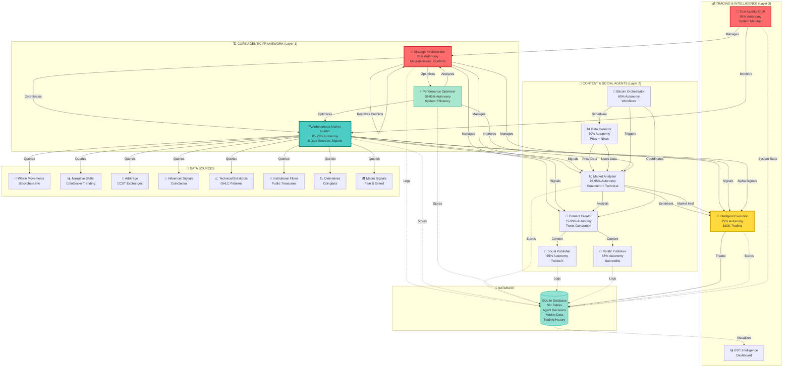

# 🤖 TweetBot Agent Architecture Diagram



## 📊 Agent Interaction Legend

### Line Types:
- **Solid Arrow (→)**: Direct communication/data flow
- **Dotted Arrow (-.->)**: Database logging/storage
- **Management (→)**: Orchestration/coordination

### Color Coding:
- 🔴 **Red**: Meta-agents (Strategic Orchestrator, TAO)
- 🔵 **Cyan**: Market Intelligence (Market Hunter)
- 🟡 **Yellow**: Execution/Trading (Intelligent Execution)
- 🟢 **Green**: Support/Infrastructure (Performance Optimizer, Database)
- ⚪ **White**: Content/Social/Data agents

---

## 🔄 Signal Flow Examples

### Example 1: Market Alert Flow
```
Whale Movement Detected (Blockchain.info)
    ↓
Market Hunter processes (confidence: 0.95)
    ↓
Signal generated: WHALE_ALERT
    ↓ ↓ ↓
    ↓ ↓ ↘ Intelligent Execution (adjusts strategy)
    ↓ ↘ Market Analyzer (updates sentiment)
    ↘ Content Creator (generates alert tweet)
```

### Example 2: Trading Decision Flow
```
Market Hunter (8 sources) → Market Context
    ↓
Market Analyzer → Sentiment Analysis
    ↓
Intelligent Execution Agent:
    • Progress to weekly goal?
    • Market sentiment?
    • Technical trend?
    • Whale activity?
    ↓
Decision: BUY 0.0523 BTC @ $94,231
    ↓
Database logs decision
    ↓
Strategic Orchestrator evaluates outcome
```

### Example 3: Content Publishing Flow
```
Data Collector → Fetches price + news
    ↓
Market Analyzer → Sentiment: 0.67 (bullish)
    ↓
Content Creator:
    • Generates tweet
    • Optimizes hashtags
    • Predicts engagement
    ↓
Social Publisher → Posts to Twitter/X
    ↓
Engagement Tracker → Measures performance
    ↓
Strategic Orchestrator → Learns from results
```

### Example 4: System Optimization Flow
```
Strategic Orchestrator observes:
    • Market Hunter success: 54%
    • Goal conflicts detected
    • Strategic misalignment
    ↓
Makes decisions:
    • AGENT_ADAPTATION (reduce autonomy)
    • CONFLICT_RESOLUTION (adjust goals)
    • SYSTEM_REALIGNMENT (optimize coordination)
    ↓
Executes adaptations:
    • Market Hunter adjusts strategy
    • Performance Optimizer improves efficiency
    • Conflicts resolved autonomously
    ↓
System learning:
    • Success rate: 100% → increase learning rate
    • Update agent reputations
    • Amplify emergent behaviors
```

---

## 🧠 Autonomy Hierarchy

```
Level 5 (95%): Strategic Meta-Agents
    ├─ Strategic Orchestrator
    └─ True Agentic Orchestrator

Level 4 (85-95%): Autonomous Intelligence
    ├─ Autonomous Market Hunter
    └─ Performance Optimizer

Level 3 (75-95%): Adaptive Agents
    ├─ Market Analyzer
    ├─ Content Creator
    └─ Intelligent Execution

Level 2 (65-70%): Task Executors
    ├─ Data Collector
    ├─ Social Publisher
    └─ Reddit Publisher

Level 1 (60%): Coordinators
    └─ Bitcoin Orchestrator
```

---

## 🎯 Decision-Making Layers

```
┌─────────────────────────────────────────┐
│     STRATEGIC LAYER (Meta-Decisions)    │
│  Strategic Orchestrator, TAO            │
│  • System-wide goals                    │
│  • Agent coordination                   │
│  • Conflict resolution                  │
└─────────────────┬───────────────────────┘
                  │
┌─────────────────▼───────────────────────┐
│    INTELLIGENCE LAYER (Analysis)        │
│  Market Hunter, Market Analyzer, PO     │
│  • Data gathering                       │
│  • Pattern detection                    │
│  • Signal generation                    │
└─────────────────┬───────────────────────┘
                  │
┌─────────────────▼───────────────────────┐
│     EXECUTION LAYER (Actions)           │
│  Execution Agent, Publishers, Creator   │
│  • Trading decisions                    │
│  • Content publishing                   │
│  • Portfolio management                 │
└─────────────────┬───────────────────────┘
                  │
┌─────────────────▼───────────────────────┐
│      STORAGE LAYER (Persistence)        │
│  Database Service                       │
│  • Decision logging                     │
│  • Performance metrics                  │
│  • Learning history                     │
└─────────────────────────────────────────┘
```

---

## 📡 Inter-Agent Communication Patterns

### 1. Broadcasting (One-to-Many)
```
Market Hunter → [All Agents]
    Signal: WHALE_ALERT
    Recipients: Execution, Analyzer, Creator
```

### 2. Request-Response (One-to-One)
```
Content Creator → Market Analyzer
    Request: "What's current sentiment?"
    Response: { sentiment: 0.67, confidence: 0.82 }
```

### 3. Negotiation (Peer-to-Peer)
```
Agent A: "I need resource X"
Agent B: "I'm using resource X"
    ↓
Strategic Orchestrator arbitrates
    ↓
Resolution: Time-sharing agreement
```

### 4. Hierarchical (Top-Down)
```
Strategic Orchestrator → Market Hunter
    Command: "Reduce autonomy to 80%"
    Reason: "Performance below threshold"
```

---

## 💾 Database Schema Overview

```
Market Hunter Tables (8):
    whale_movements
    narrative_shifts
    arbitrage_opportunities
    influencer_signals
    technical_breakouts
    institutional_flows
    derivatives_signals
    macro_signals

Agent Decision Tables (4):
    agent_executions
    system_alerts
    alpha_discoveries
    strategic_decisions

Trading Tables (3):
    portfolio_state
    trading_history
    system_config

Analytics Tables (2):
    engagement_metrics
    performance_history
```

---

**Diagram Generated**: Based on comprehensive codebase analysis
**Total Agents**: 14+ identified and mapped
**Architecture Layers**: 3 (Core Agentic, Content/Social, Trading)
**Data Sources**: 8 real-time APIs
**Database Tables**: 50+
