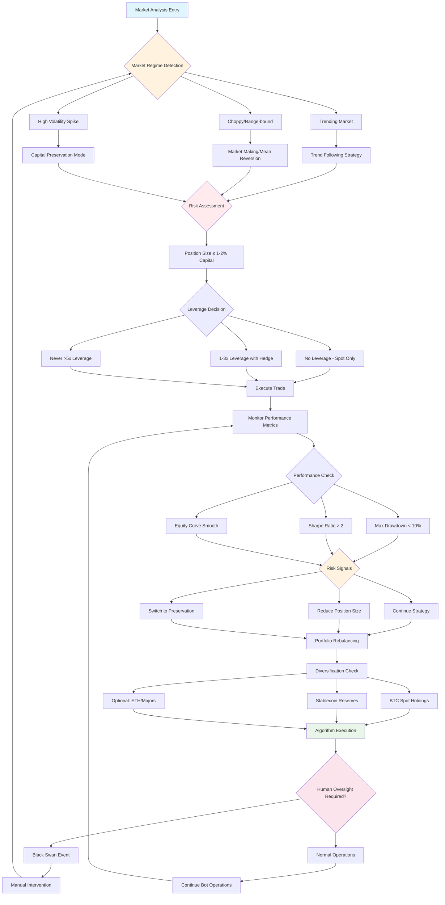
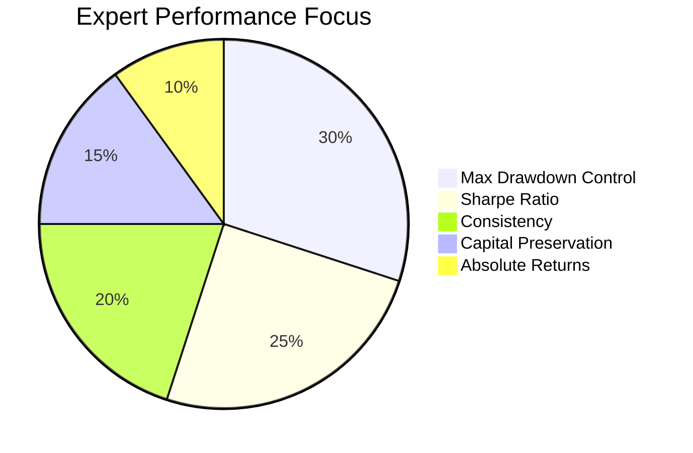
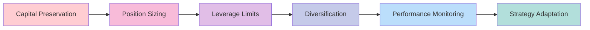

# BTC Expert Methodology - Decision Flow

## 🔑 How BTC Experts Typically Operate

Unlike casual bots, real experts treat BTC as a **high-volatility asset**. Their methods focus less on "predicting" and more on **risk control + exploiting repeatable market behaviors**.

## Expert Trading Methodology Flow

## Key Principles Breakdown

### 1. **Capital Preservation First**
- Never risk large chunks of portfolio
- Typical rule: risk ≤ 1–2% of capital per trade
- Diversify across asset types and strategies

### 2. **Market Regime Adaptation**
- **Trending**: Bull runs, halving cycles → Trend following
- **Choppy**: Low volatility, sideways → Market-making/mean reversion  
- **Volatile**: Macro events, liquidations → Capital preservation

### 3. **Risk-Adjusted Focus**
- Obsess over max drawdown, Sharpe/Sortino ratios
- Equity curve smoothness over absolute returns
- Target: 30% return + 10% drawdown (Sharpe > 2) > 200% return + 70% drawdown

### 4. **Leverage Discipline**
- Usually 1–3x leverage maximum
- Often trade spot-only for safety
- Survival > fast profits mentality

### 5. **Algorithmic with Human Oversight**
- Bots enforce rules (sizing, stops, limits)
- Humans intervene during black swan events
- Rules-driven but adaptable

## Performance Metrics Priority

## Risk Management Hierarchy

This methodology emphasizes **survival and consistency** over dramatic gains, which is what separates professional BTC traders from retail speculators.