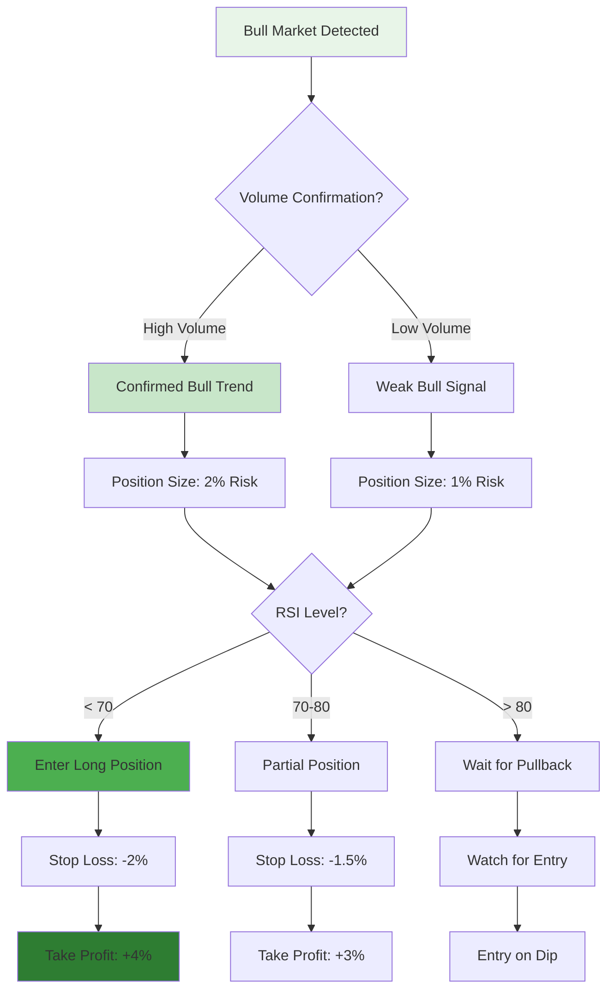
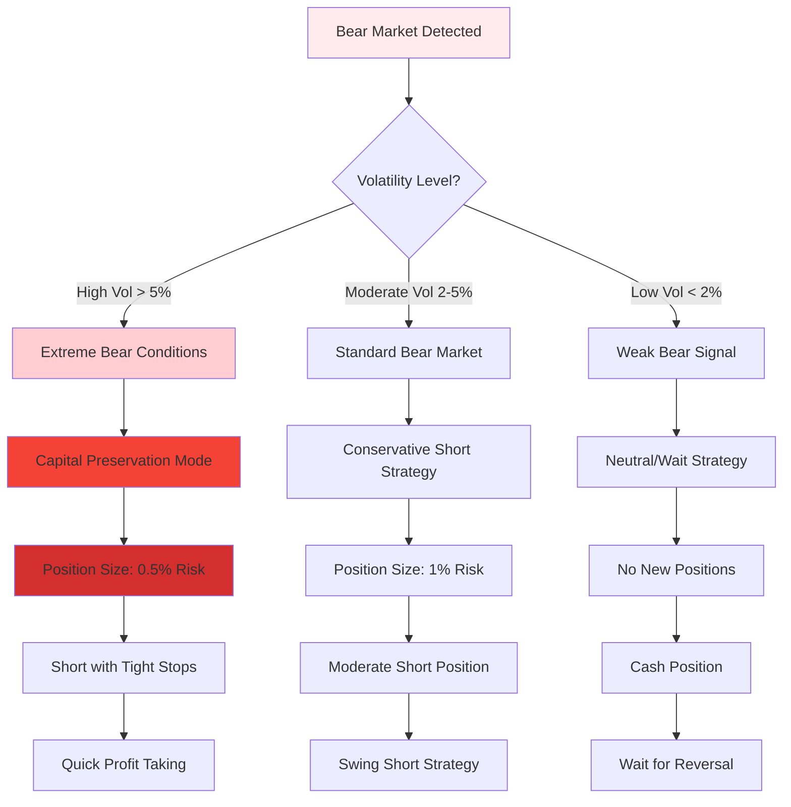
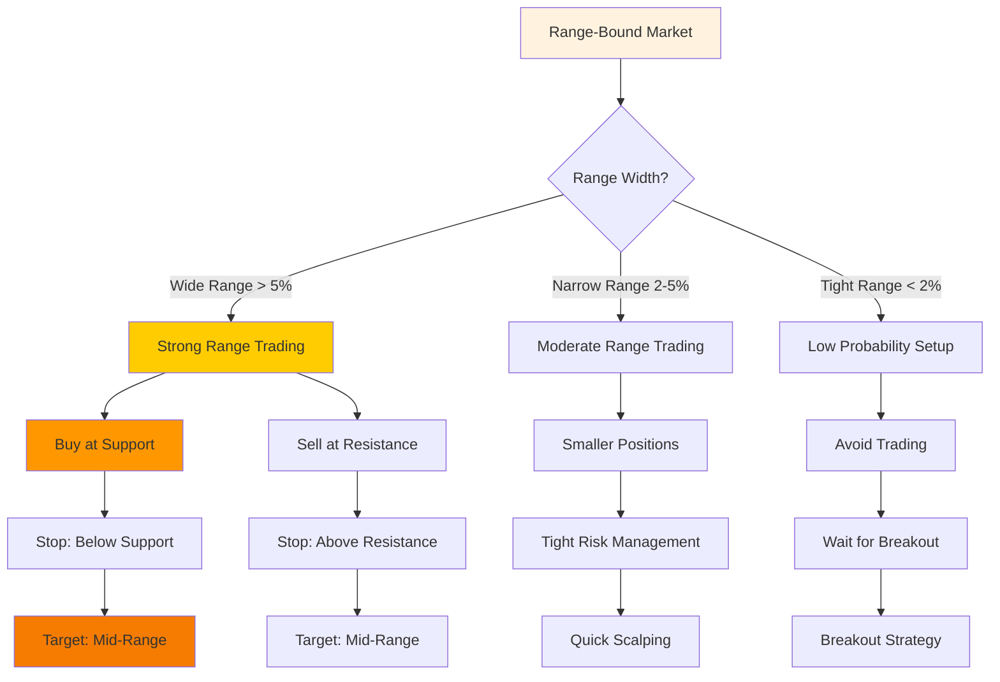
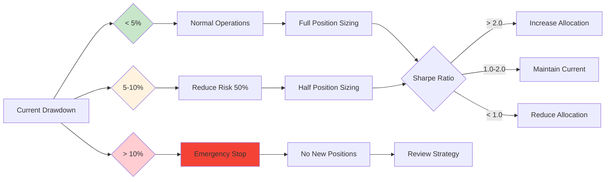
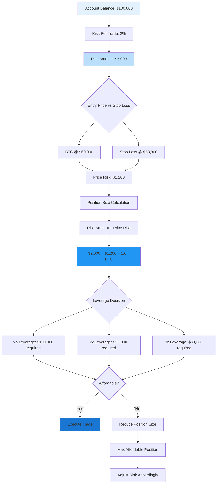
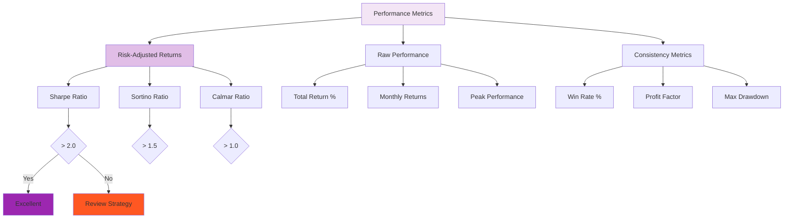
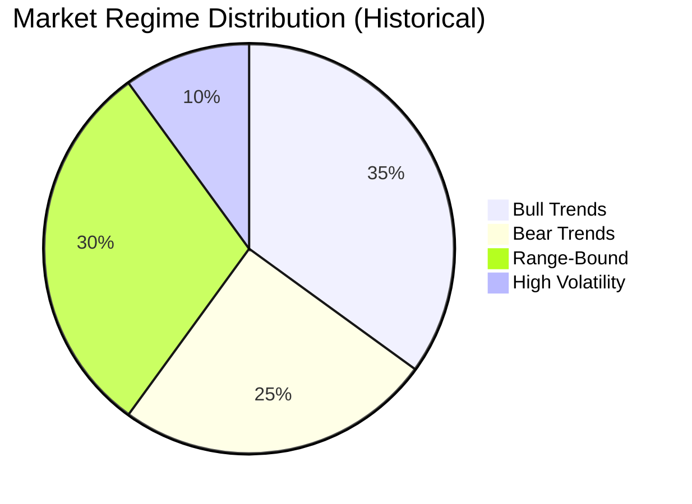
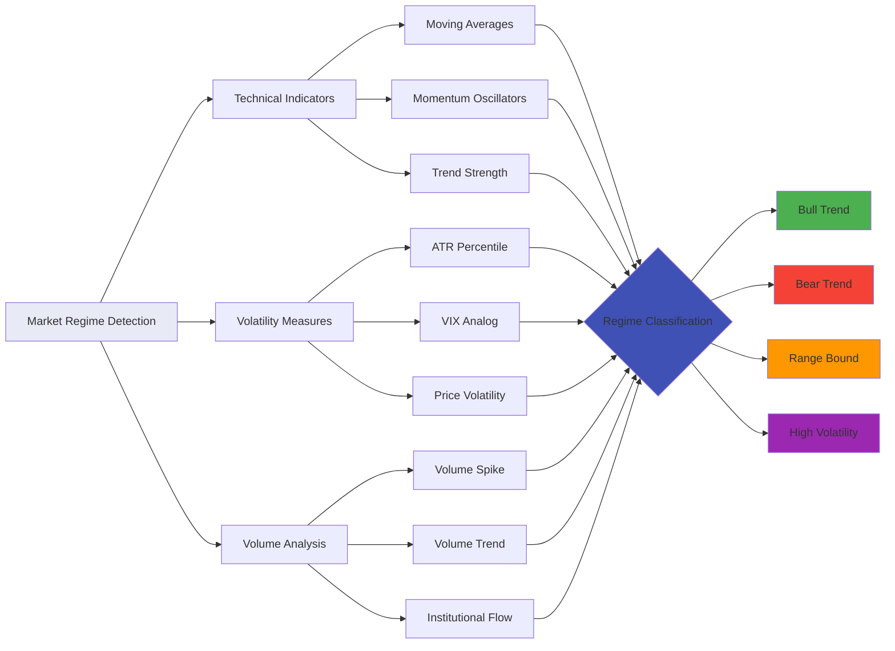
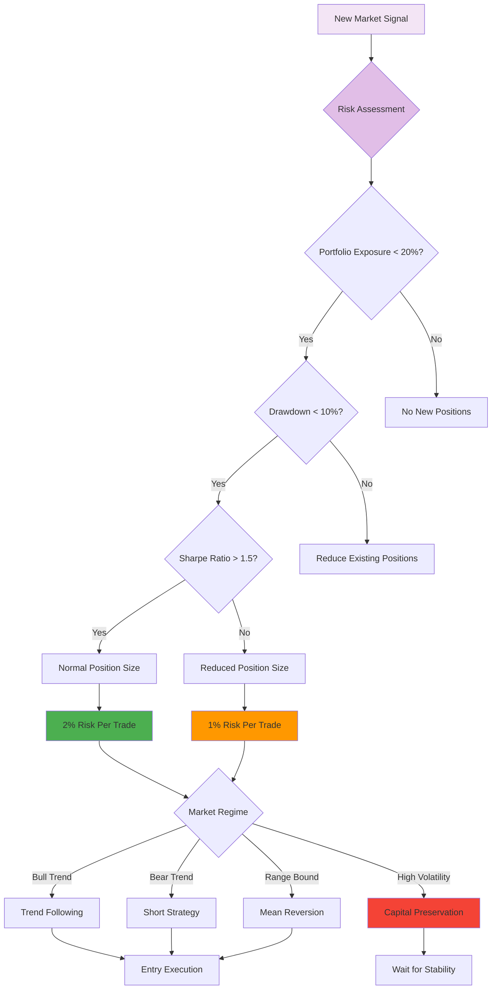
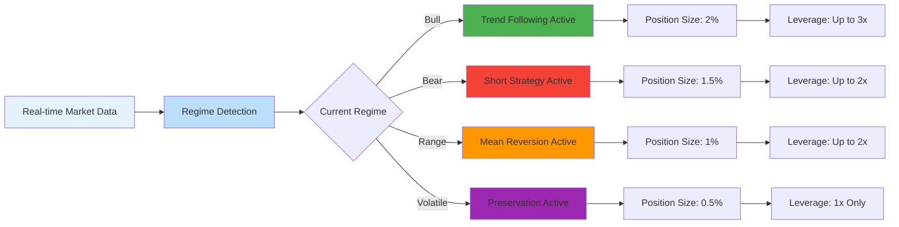

# BTC Trading Scenarios - Expert Visualizations

## 🎯 Scenario-Based Decision Trees

### Bull Market Scenario Analysis

### Bear Market Scenario Analysis

### Range-Bound Market Scenario

## 📈 Risk Management Decision Matrix

## 🎛️ Position Sizing Calculator Flow

## 📊 Performance Analysis Hierarchy

## 🌊 Market Regime Classification

## 🎯 Expert Trading Rules Flowchart

## 🏆 Expert Performance Benchmarks

| Metric | Beginner | Intermediate | Expert | Elite |
|--------|----------|--------------|--------|-------|
| Sharpe Ratio | < 0.5 | 0.5 - 1.0 | 1.0 - 2.0 | > 2.0 |
| Max Drawdown | > 25% | 15-25% | 5-15% | < 5% |
| Win Rate | < 40% | 40-50% | 50-60% | > 60% |
| Profit Factor | < 1.2 | 1.2-1.5 | 1.5-2.0 | > 2.0 |
| Consistency | Low | Medium | High | Very High |

## 🔄 Adaptive Strategy Selection

This comprehensive visualization framework provides expert-level decision trees for every major trading scenario, ensuring the autonomous agents have clear guidance for professional-level trading decisions.